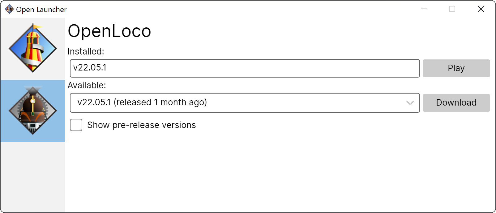

# Launcher for OpenRCT2 and OpenLoco

A launcher for automatically downloading the latest, or specific versions of [OpenRCT2](https://github.com/OpenRCT2/OpenRCT2) and [OpenLoco](https://github.com/OpenLoco/OpenLoco).

<a href="docs/launcher.png"></a>

# 🚀 Installation
1. Download the latest version of the launcher from the [Releases page](https://github.com/OpenRCT2/OpenLauncher/releases).
2. Save the file anywhere on your system and run it.
## Debian/Ubuntu
1. Download the .deb file from the [Releases page](https://github.com/OpenRCT2/OpenLauncher/releases).
2. Run this command in the location you've downloaded the .deb file to:
   
   ``` sudo apt install ./openlauncher-*.deb ```
## Fedora
1. Copy the link to the .rpm file from the [Releases page](https://github.com/OpenRCT2/OpenLauncher/releases).
2. Run this command as root
   
   ``` yum localinstall <link_to_rpm> ```
   
# 🔨 Building

**OpenLauncher** is written in C# using the [AvaloniaUI](http://avaloniaui.net) framework. The application currently targets [.NET 8](https://dotnet.microsoft.com) and is typically distributed as a self contained executable.

### Prerequisites
* [.NET 9 SDK](https://dotnet.microsoft.com/en-us/download/dotnet/9.0) or newer — required to build, as Avalonia 12's source generators do not run under the .NET 8 SDK. The application itself still targets .NET 8.
* [Visual Studio](https://visualstudio.microsoft.com) (optional)
  * [AvaloniaUI extension](https://marketplace.visualstudio.com/items?itemName=AvaloniaTeam.AvaloniaVS) (optional)
* [Visual Studio Code](https://code.visualstudio.com) (optional)

### Running
You can quickly build and run the launcher on the command line using the following command.
```
dotnet run --project src/openlauncher
```

Alternatively, open `openlauncher.sln` in Visual Studio. Installing the [extension](https://marketplace.visualstudio.com/items?itemName=AvaloniaTeam.AvaloniaVS) for AvaloniaUI is recommended.


# ⚖️ Licence
**OpenLauncher** is licensed under the MIT License.
